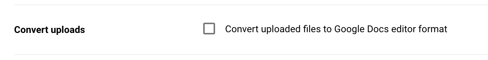

# google-drive-storage

A Dat Storage Provider for Google Drive

Work in progress

## Install

I highly recommend you go into your Google Drive Settings and Uncheck this box, otherwise Google Drive won't store the raw binary versions of your text documents, requiring you to export them before downloading.

